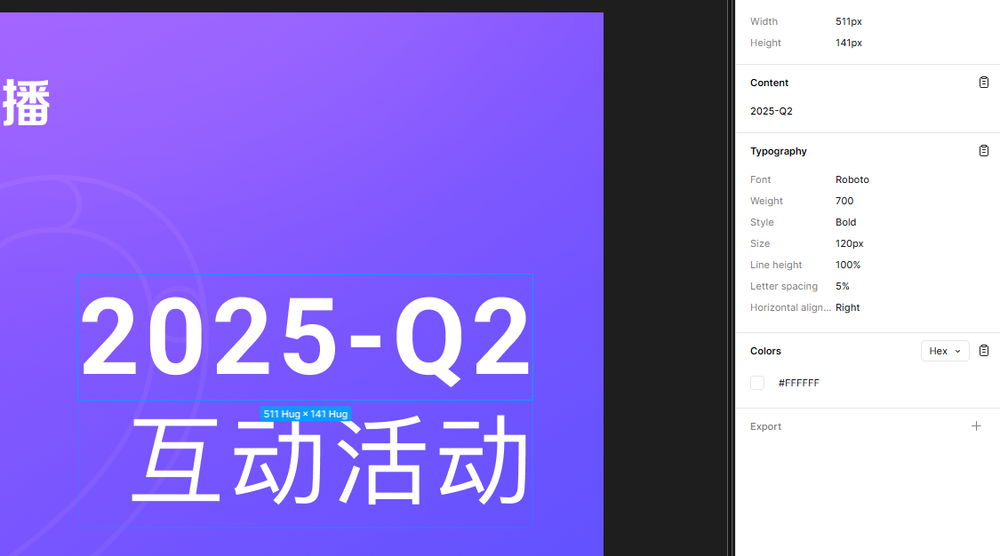
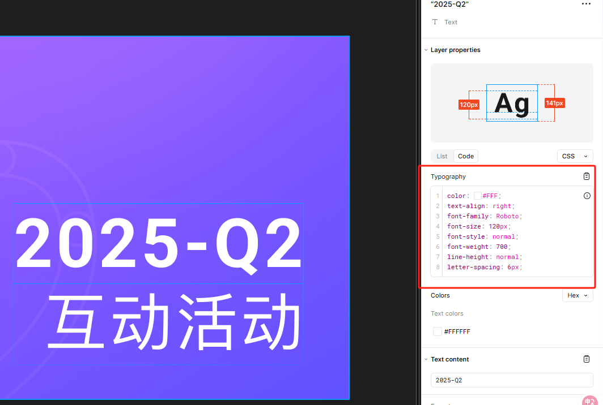
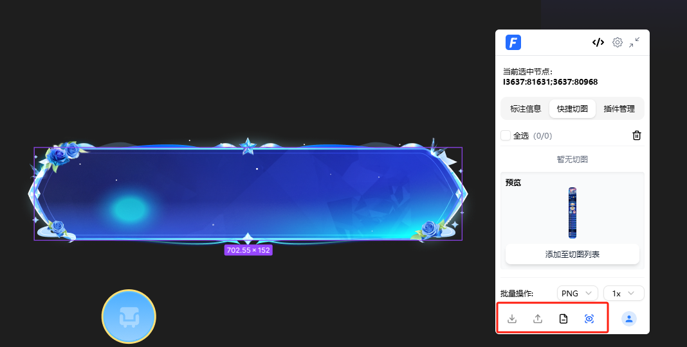
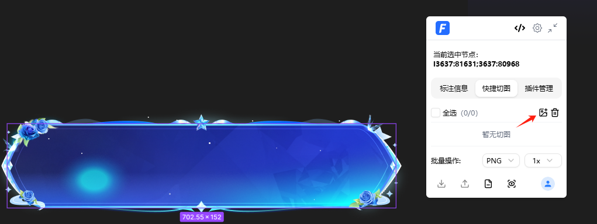
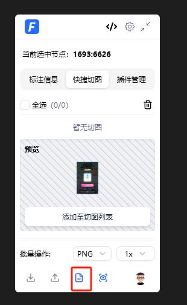
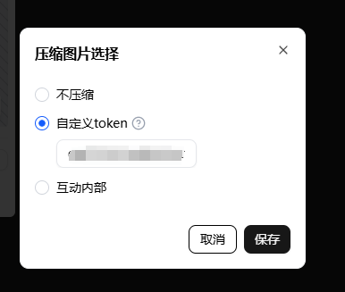
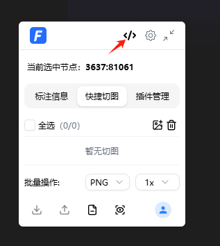
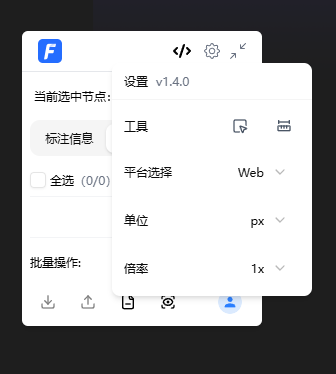
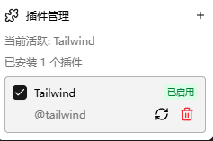
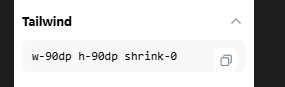

F2C生态的[新Chrome插件](https://chromewebstore.google.com/detail/f2c/gmcgpjgoiidajfjhdooaajaeonnmikfc)****1.5.0版本****已经正式上架！下面将系统的介绍该插件的细节。

# 背景

## Figma商业化

众所周知在Figma Dev Mode出现之前，相关的图层节点标注信息是能够在****免费、只读****的情况下查看到的。

上图是2022年的Figma版本，可以看到在右下方能够显示图层节点的相关CSS代码。

随着Dev Mode出现，没有购买其席位的开发者需要****付费****进行查看。参考下图：

（当然你点击复制也能拷贝到部分样式，如果你需要完整的，需要每个部分都点击复制

## Figma插件的局限性

为了方便公司内部开发者方便的获取图层节点的相关信息，F2C团队先前为公司没有席位的开发者开发了[Figma插件](https://www.figma.com/community/plugin/1248187540929489451/f2c-figma-to-code-react-rn-vue-html-yy-d2c)来应对，但是其局限性在于需要开发者拥有​****编辑权限****​。为此开发者需要将设计稿的代码先拷贝一份到本地草稿，若设计稿内容偏多，则十分消耗时间。



基于以上两个背景，[新Chrome插件](https://chromewebstore.google.com/detail/f2c/gmcgpjgoiidajfjhdooaajaeonnmikfc)应运而生。

# 功能

[新Chrome插件](https://chromewebstore.google.com/detail/f2c/gmcgpjgoiidajfjhdooaajaeonnmikfc)能够让开发者在浏览器中在****只读权限下****进行：图层节点信息查看、切图下载或上传、生成代码等一系列动作。

## 标注信息

选择任意元素能看到类devtool的盒模型信息，相关的CSS代码或者JavaScript内联代码，相关的属性以及背景颜色。

## 切图

选中要切图的图层节点即可看到该图层节点的预览图片，点击【添加至图层列表】即可在切图列表看到该图。

下方操作栏从左到右分别为：下载到本地、上传至Bos（暂对YY内部）、[tinypng](https://tinypng.com/)压缩、预览模式。

预览模式遇到大图层文件有时候会有所卡顿，介意的同学可以关闭预览。关闭预览后点击右上角添加按钮即可添加图片到列表：

### Tiny压缩

点击压缩图片按钮能看到一个弹窗让用户选择：不压缩、自定义Token、互动内部。其中选择后两项则在图片下载或者上传的时候进行自动压缩。

其中选择****自定义Token****可以通过前往[tinypngtoken获取链接](https://tinify.com/developers)获取到token，每个用户每个月可以免费使用500次压缩。获取到token之后填入保存即可。

选择互动内部的话，需要用户优先登录自己的账号方可使用。

# 生成代码

点击右上角的代码按钮可以生成代码，由于脱离了Figma App环境，我们需要为开发者生成一个****Figma合法Token****来访问设计稿【官方提供】。若之前未授权，点击会跳转至Figma官方授权页面，点击****Allow access****即可获得。

返回代码模块我们可以看到该图层节点的预览图，底下三个按钮分别为：下载代码文件到本地、浏览器预览代码、跳转至[Comate IDE](https://comate.baidu.com/zh/download/ai-ide)进行更多操作。

其中跳转到[Comate IDE](https://comate.baidu.com/zh/download/ai-ide)后会自动开启zulu帮你生成代码！非常方便！

# 工具栏

工具栏中有一些使用的工具供用户使用。其中

是帮你选中深层次的节点，相当于figma快捷键Ctrl（Win）、Meta（Mac）。

是帮你自动启用figma测量功能，相当于figma快捷键Alt。

剩下的单位和平台我们兼容Web、安卓和IOS平台，其中安卓和IOS平台单位为dp。

# 插件

插件系统完全兼容[tempad-dev](https://chromewebstore.google.com/detail/tempad-dev/lgoeakbaikpkihoiphamaeopmliaimpc)。

# 对比

当然市面已经有一些相关的插件，例如：[tempad-dev](https://chromewebstore.google.com/detail/tempad-dev/lgoeakbaikpkihoiphamaeopmliaimpc)、[fubukicss-tool](https://chromewebstore.google.com/detail/fubukicss-tool/behnfolmiinfhphfdolomedncdnogcim)。我们也参考了其一些优秀的功能，再次对他们的开发者表示尊敬和感谢。与其相比，我们能够与F2C&Comate生态进行打通，实现了生成高还原度代码的能力。配合[f2c-mcp](https://github.com/f2c-ai/f2c-mcp)、[Comate IDE](https://comate.baidu.com/zh/download/ai-ide)，能够将生成的代码更加的拟人化，达到工业级别的代码输出，更便利于开发者采纳和使用。

# 未来

未来我们将结合F2C&Comate生态，配合[f2c-mcp](https://github.com/f2c-ai/f2c-mcp)、[Comate IDE](https://comate.baidu.com/zh/download/ai-ide)实现更多功能，包括但不限于：

1. 图片上传服务自定义
2. 设计稿信息配置上传
3. prompt to figma，一句话生成设计稿
4. 智能识别设计与开发组件，打通prompt to fimga to code功能

其中3和4已经有实质性的进展，敬请期待。

# 意见与反馈

意见反馈&交流如流群：[8654130](https://applink-infoflow.baidu.com/share/contact/open/?token=4zw5n3U3pv117eYegjH0zoVsmD7khVvzJuxaIGihZ1E)
