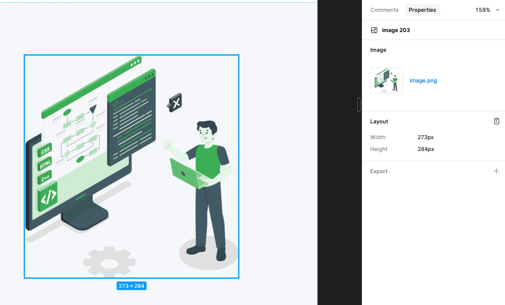
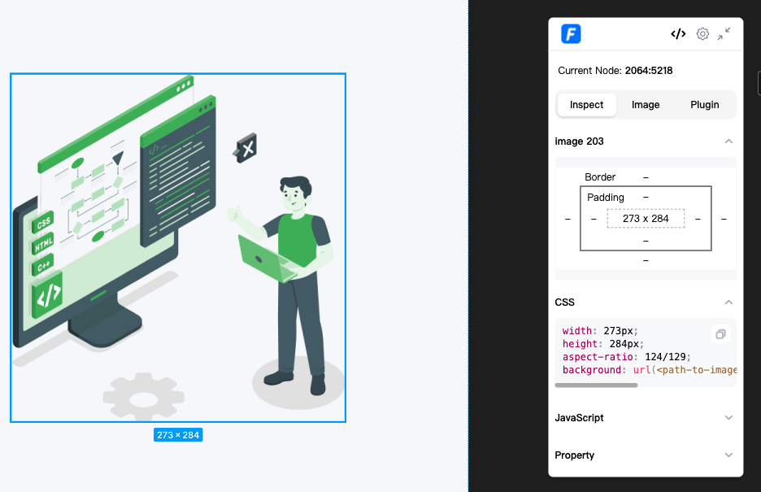
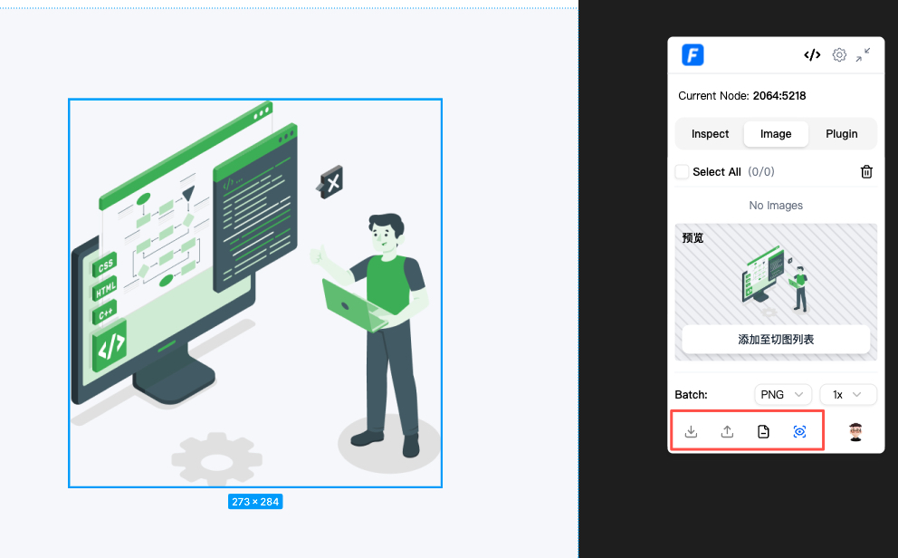
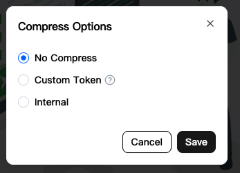
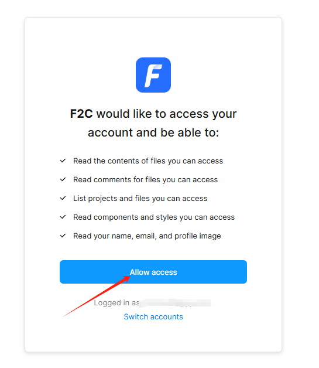
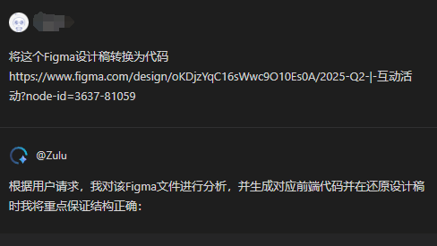
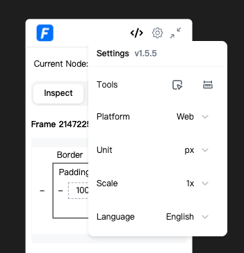
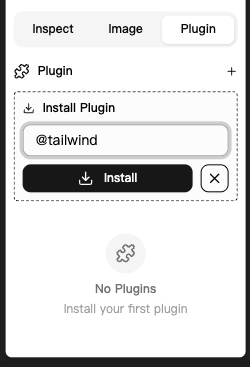
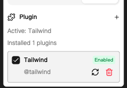
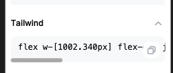

The ****1.5.0 version**** of the F2C ecosystem's [new Chrome plugin](https://chromewebstore.google.com/detail/f2c/gmcgpjgoiidajfjhdooaajaeonnmikfc) is officially live! The details of the plugin will be systematically introduced below.

# Background

## Figma's Commercialization

As we all know, before the advent of Figma's Dev Mode, information about layer node annotations could be viewed for ****free and in a read-only**** state.

The image above is from the 2022 version of Figma. You can see that the relevant CSS code for the layer node is displayed in the lower right corner.

With the emergence of Dev Mode, developers who have not purchased a seat need to ****pay**** to view it. Refer to the image below:

## Limitations of Figma Plugins

To make it easier for the company's internal developers to obtain information about layer nodes, the F2C team previously developed a [Figma plugin](https://www.figma.com/community/plugin/1248187540929489451/f2c-figma-to-code-react-rn-vue-html-yy-d2c) for developers without a seat. However, its limitation was that it required developers to have ​****edit permissions****​. This meant developers had to first copy the design file to their local drafts, which was very time-consuming if the design file was large.

Based on the two background points above, the [new Chrome plugin](https://chromewebstore.google.com/detail/f2c/gmcgpjgoiidajfjhdooaajaeonnmikfc) was born.

# Features

The [new Chrome plugin](https://chromewebstore.google.com/detail/f2c/gmcgpjgoiidajfjhdooaajaeonnmikfc) allows developers to perform a series of actions in the browser with ​****read-only permissions****​: viewing layer node information, downloading or uploading assets, generating code, and more.

## Annotation Information

Select any element to see devtool-like box model information, the relevant CSS code or JavaScript inline code, related properties, and background colors.

## Asset Slicing

Select the layer node you want to slice to see a preview image of that node. Click [Add to Layer List] to see the image in the asset list.

The operation bar below, from left to right, is for: downloading to local, uploading to Bos (currently for YY internal use), compressing with [tinypng](https://tinypng.com/), and preview mode.

Preview mode can sometimes be laggy with large layer files. If this bothers you, you can turn off the preview. After turning off the preview, you can add images to the list by clicking the add button in the top right corner:

### Tiny Compression

Clicking the compress image button will show a pop-up window allowing the user to choose: No compression, Custom Token, or Internal. Selecting the latter two options will automatically compress the image during download or upload.

By selecting ​****Custom Token****​, you can get a token by visiting the [tinypng token acquisition link](https://tinify.com/developers). Each user can use 500 free compressions per month. After getting the token, fill it in and save.

If you choose Internal, the user needs to log in to their account first to use it.

# Code Generation

Click the code button in the top right corner to generate code. Since it is detached from the Figma App environment, we need to generate a ****legitimate Figma Token**** for the developer to access the design file [officially provided]. If you have not authorized it before, clicking will redirect you to the official Figma authorization page. Click ****Allow access**** to obtain it.

Returning to the code module, we can see a preview of the layer node. The three buttons below are for: downloading the code file to local, previewing the code in the browser, and jumping to [Comate IDE](https://comate.baidu.com/zh/download/ai-ide) for more operations.

Jumping to [Comate IDE](https://comate.baidu.com/zh/download/ai-ide) will automatically start zulu to help you generate code! Very convenient!

# Toolbar

The toolbar has some useful tools for users. Among them

helps you select deeply nested nodes, equivalent to the Figma shortcut Ctrl (Win), Meta (Mac).

helps you automatically enable the Figma measurement function, equivalent to the Figma shortcut Alt.

The remaining units and platforms are compatible with Web, Android, and iOS platforms, with the units for Android and iOS being dp.

# Plugins

The plugin system is fully compatible with [tempad-dev](https://chromewebstore.google.com/detail/tempad-dev/lgoeakbaikpkihoiphamaeopmliaimpc).

Step.1

Step.2

Step.3



# Comparison

Of course, there are already some related plugins on the market, such as [tempad-dev](https://chromewebstore.google.com/detail/tempad-dev/lgoeakbaikpkihoiphamaeopmliaimpc), [fubukicss-tool](https://chromewebstore.google.com/detail/fubukicss-tool/behnfolmiinfhphfdolomedncdnogcim). We have also referenced some of their excellent features and would like to express our respect and gratitude to their developers. Compared to them, we are able to integrate with the F2C & Comate ecosystem, achieving the ability to generate high-fidelity code. In conjunction with [f2c-mcp](https://github.com/f2c-ai/f2c-mcp) and [Comate IDE](https://comate.baidu.com/zh/download/ai-ide), the generated code can be made more human-like, achieving industrial-grade code output, which is more convenient for developers to adopt and use.

# Future

In the future, we will combine the F2C & Comate ecosystem, in conjunction with [f2c-mcp](https://github.com/f2c-ai/f2c-mcp) and [Comate IDE](https://comate.baidu.com/zh/download/ai-ide) to implement more features, including but not limited to:

1. Customizable image upload services
2. Uploading design file information configurations
3. Prompt to Figma, generate a design file with a single sentence
4. Intelligently identify design and development components, enabling prompt to figma to code functionality

Among these, 3 and 4 have already made substantial progress. Please stay tuned.

# Opinions & Feedback

For feedback & communication, Please go to our GitHub address: [**https://github.com/f2c-ai/f2c-mcp/issues**](https://github.com/f2c-ai/f2c-mcp/issues)
We sincerely welcome everyone's feedback.
