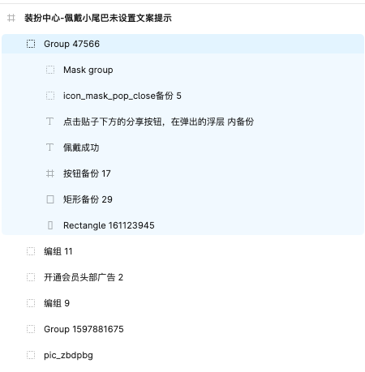
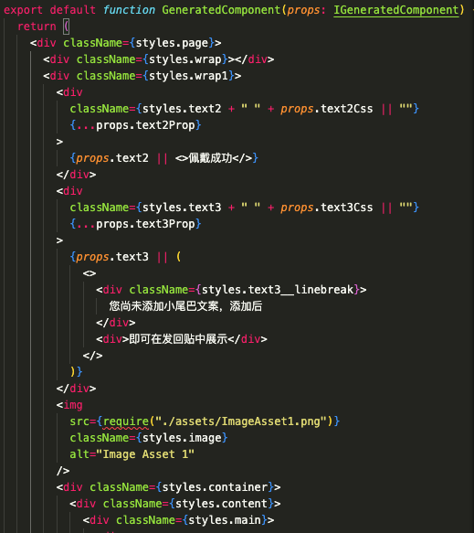
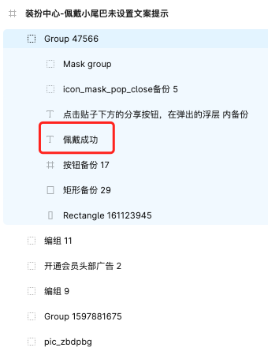
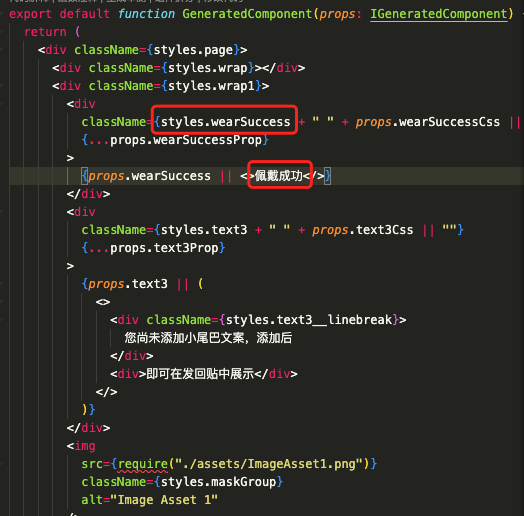
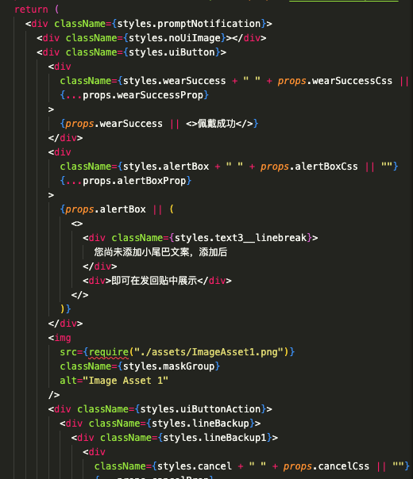
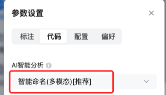

# 智能命名

在智能命名(文生文)的基础上，F2C生成代码的语义化程度取决于设计师图层命名的语义化程度，在业务上平均覆盖率只能达到40%-50%左右，部分代码块无法达到语义化的要求。

## 智能命名 v0 - 层级规则

初版本，我们使用规则命名方式（如下表），确保层级关系与css classname命名不会相互污染，保证还原效果；这种方案的缺点是缺乏语义化

| **层级** | **类型** | **命名**         |
| ----------- | ----------- | ------------------- |
| 1         | div       | page + 序号       |
| 2         | div       | wrap + 序号       |
| 3         | div       | container + 序号  |
| 4         | div       | content + 序号    |
| 5         | div       | main + 序号       |
| 6         | div       | section + 序号    |
| 7         | div       | subSection + 序号 |
| 9         | div       | block + 序号      |
| 9         | div       | subBlock + 序号   |
| /         | img       | img + 序号        |
| /         | text      | text + 序号       |

智能命名V0版本的实际效果如下：

| **图层示例**                                                                                                                                 | **图层预览**                                                                                                                               | **生成代码**                                                                                                                               |
| ----------------------------------------------------------------------------------------------------------------------------------------------- | --------------------------------------------------------------------------------------------------------------------------------------------- | --------------------------------------------------------------------------------------------------------------------------------------------- |
|  |  |  |



## 智能命名 v1.0 - 层级规则 + 文生文

v1版本，我们使用AI服务对图层名进行翻译，大概可以覆盖40%-50%的图层节点，这个方案的不足是代码的语义化只能受限于设计师的图层语义

> 对于图层名转换的 Prompt 大致规则如下：
> 
> * 使用缩写翻译成4个英文单词，保留数字，并将第一个字母转换为小写。
> * 从变量名称中删除非字母数字字符。
> * 如果变量名以数字开头，请添加前缀“num”。
> * 如果名称超过20个字符，则将其截断为前20个字符。
> * 检查所有变量名称。如果有重复，请在末尾添加一个数字

智能命名V1版本的实际效果如下：

| **图层示例**                                                                                                                               | **图层预览**                                                                                                                               | **生成代码**                                                                                                                               |
| --------------------------------------------------------------------------------------------------------------------------------------------- | --------------------------------------------------------------------------------------------------------------------------------------------- | --------------------------------------------------------------------------------------------------------------------------------------------- |
|  |  |  |

可以看到这个方案的效果依赖于设计师是否有符合预期的图层命名（一般是中文），设计师越按照语义进行设计稿命名，我们得出的代码命名就越符合预期。

# 智能命名 v2.0

## 图生文大模型方案

使用多模态（视觉语言模型+文本语言模型）优化class命名，详见[多模态优化class命名实验](https://ku.baidu-int.com/knowledge/HFVrC7hq1Q/pKzJfZczuc/TfJeM3b51S/luJqKl3-480Ydv)[多模态优化class命名方案评审](https://ku.baidu-int.com/knowledge/HFVrC7hq1Q/pKzJfZczuc/TfJeM3b51S/Eoh91TdVGDuIOs)

## 时序调整

在 v1.0 版本中，我们将命名服务集成至 f2c-ide-server，旨在将远程服务统一到一个端口。然而，随着接入端口和 IDE 种类的不断增加，维护多个端口的后置处理脚本变得愈发复杂。

在 v2.0 版本中，我们通过将 AI 服务前置于 jsonSchema 层，优化了处理流程，使得多个端口能够共享 AI 优化的处理结果。

[流程图]## **渐进式智能命名策略**

* **渐进式智能命名** (文生文 + 图生文): 我们优先使用效率更高的『文生文』命名，通过规则（见下表）我们会预知文生文效果不佳时，使用『图生文』命名作为补充以覆盖所有 case。这样做提高了性能和资源利用，在保证结果质量的同时，减少处理时间。
* ​**模拟多模态并行处理**​：由于我们使用规则预先收集了待处理节点，这两个 LLM 服务可以并行处理，减少用户等待时间。

我们对大部分图层的命名情况总结为下表：

| **🎬 图层名示例**                   | **🔍 文生文** | **⚙️ 图生文** |
| -------------------------------------- | ---------------- | ------------------ |
| Group xx 、编组xx                    |              | 🟩 使用          |
| Mask group、蒙版xx                   |              | 🟩 使用          |
| Rectangle xx、矩形 xx                |              | 🟩 使用          |
| Frame xx                             |              | 🟩 使用          |
| Component xx                         |              | 🟩 使用          |
| Text xx                              |              | 🟩 使用          |
| Line xx                              |              | 🟩 使用          |
| Ellipse xxx                          |              | 🟩 使用          |
| 文本节点（\*当内容与图层名相同）     | 🟩 使用        |                |
| 文文本节点（\*当内容与图层名不相同） |              | 🟩 使用          |
| 除以上情况外的中文节点               | 🟩 使用        |                |

## 2.3 生成效果对比

| **图层预览**                                                                                                                               | **v1代码预览**                                                                                                                             | **v2代码预览**                                                                                                                             |
| --------------------------------------------------------------------------------------------------------------------------------------------- | --------------------------------------------------------------------------------------------------------------------------------------------- | --------------------------------------------------------------------------------------------------------------------------------------------- |
|  |  |  |

# 方案对比

数值解析：

1. 【v2.0覆盖率提升】公式：* (V2覆盖图层数 - V1覆盖图层数) / V2覆盖图层数*  （假设 V2覆盖率达到 100%）
2. 【总耗时】：设计素材规模，素材精度会影响导出图片的时间，最终影响总耗时
3. 【v2.0耗时增幅】：由于文生文与图生文是并行进行，估使用此公式推导：（*图生文耗时 -  文生文耗时）/ 总耗时*

| 设计图                                                                                                                                      | 图层规模 | **\*v2.0覆盖率提升** | 文生文耗时 | 图生文耗时 | \*总耗时 | **\*v2.0耗时增幅** |
| --------------------------------------------------------------------------------------------------------------------------------------------- | ---------- | ----------------------- | ------------ | ------------ | ---------- | --------------------- |
|  | 14       | **+50%**             | 3.75s      | 4.96s      | 6.35s    | **19%**            |
|  | 64       | **+40%**             | 6.13s      | 6.67s      | 9.49s    | **5%**             |
|  | 49       | **+37%**             | 4.17s      | 5.44s      | 10.01s   | **13%**            |

## 结论

随机抓去3个 case，我们v2.0方案发现引入文生图后，覆盖率平均​**提升42%**​，耗时平均**​仅增加10%​**左右，符合预期

目前，我们可以通过插件设置开启v2版本的智能命名。

