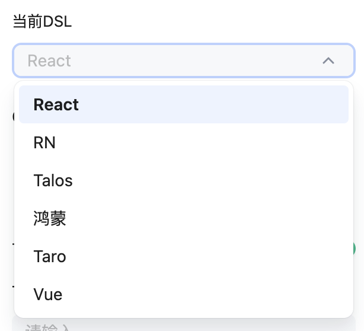

# 基本用法
:::tip
[视频演示](https://www.bilibili.com/video/BV1D5gPeLEMZ/?vd_source=7fcf31abc7924b3dd8be9356b65e1c92)
:::

参考[**快速开始**](../start/quick-start.mdx)已经详细描述了如何开始使用YY F2C转代码，这里具体阐述部分`转码设置`的作用

## AI智能命名
- 默认值： 无

- 作用：开启后F2C转码后将使用GPT进行图层翻译，将图层的中文名称转化为英文变量带入到代码中
> 注意该设置仅内部使用，外网用户请选择`无`

## DSL框架选择

- 默认值： React
- 作用：根据需要选择生成代码的开发语言

