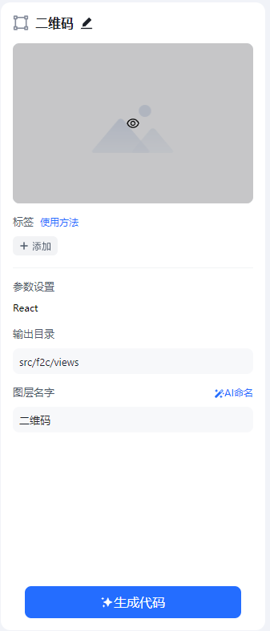

# 基本用法
<!-- :::tip
[视频演示](http://learn.baidu.com/pages/index.html#/video/?courseId=50590&elementId=7b9563c1-97ce-4b1e-a2bd-fb0767907dee&groupId=null&curPlayIndex=1)
::: -->

[**快速开始**](../start/quick-start.mdx)已经详细描述了如何开始使用YY F2C转代码，因此该文档只解释一些具体用法。

连接上 **f2c-server** 后，将会看到如下页面

- 标签按钮可以为该图层添加标签信息，详细内容见进阶标签用法文档。
- 参数设置为你选择的代码类型和相关配置，具体见[配置](./setting.md)。
- 输出目录和图层名字均用于**f2c-server**在本地文件生成的目录和文件夹名，可以根据自己的意愿修改。另外，图层命名可以使用AI生成（供内部使用），AI将识别改图层的具体信息来给图层附上语义化的名称。