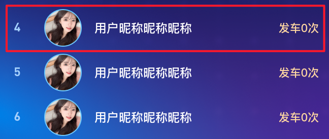
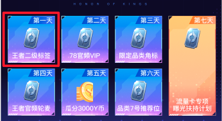
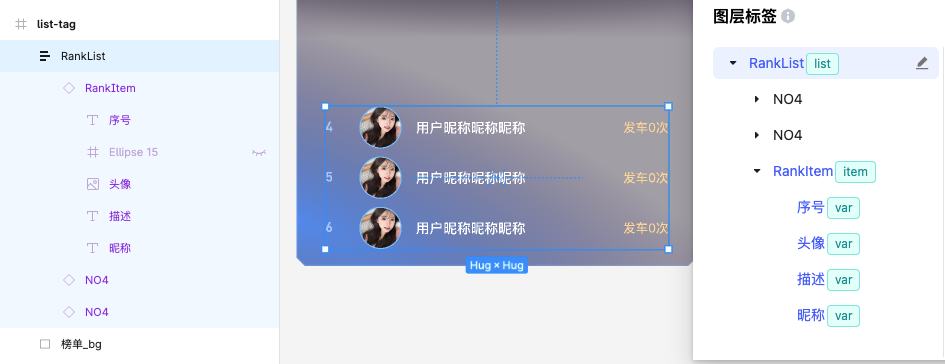
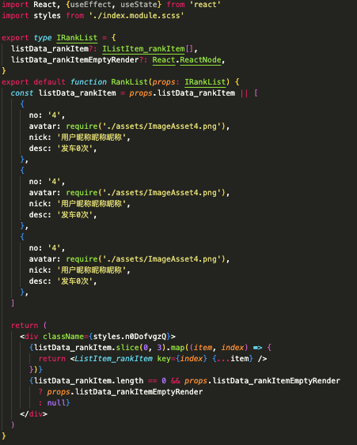
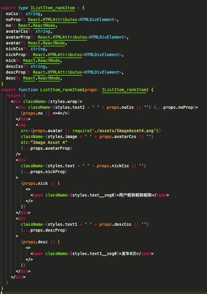

# [进阶] list 用法

## 简介[​](http://localhost:3000/docs/showcase/list#%E7%AE%80%E4%BB%8B)

`list`标签主要用来处理`列表`中组件重复的使用场景，其需要和`item`标签结合使用。列表图层使用`list`标签，item图层使用`item`标签，会为其创建一个`<Item />`组件。

例如：

## 使用示例

若未安装f2c插件，请阅读[F2C 快速上手](https://ku.baidu-int.com/knowledge/HFVrC7hq1Q/M-wK0zh99p/mTQY0VEf8w/Z3NSVyUXRhnTxB)。

Figma设计稿：[https://www.figma.com/design/eQ6iQwUJPCVtZFwSPxdHBv/F2C%E8%BF%9B%E9%98%B6%E7%94%A8%E6%B3%95?node-id=460-1530&t=s3LEruNvD8zoVKK9-4](https://www.figma.com/design/eQ6iQwUJPCVtZFwSPxdHBv/F2C%E8%BF%9B%E9%98%B6%E7%94%A8%E6%B3%95?node-id=460-1530&t=s3LEruNvD8zoVKK9-4)

### 第一步，将list与item节点按如图添加tag

### 第二步，生成代码

1. 首先是RankList的代码，我们为item节点生成了listData数据
2. list节点会自动创建列表循环代码

1. Item组件被抽取，带有var标签的节点被创建变量入参

