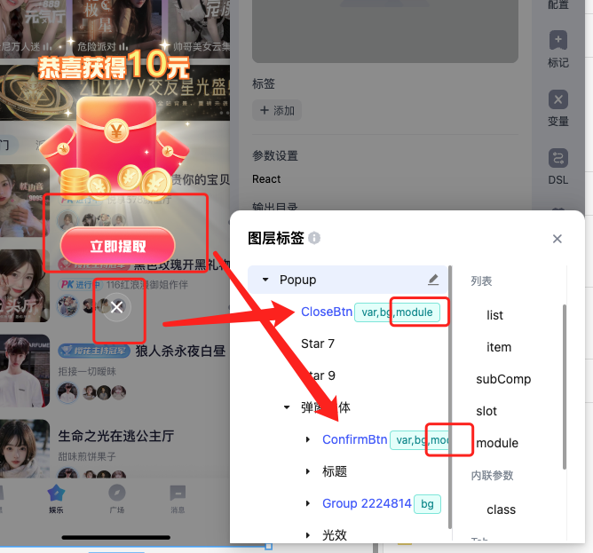
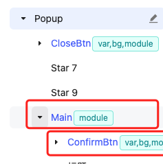
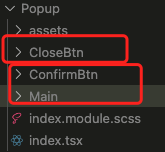
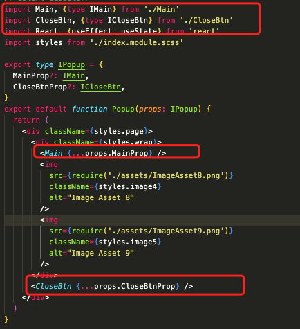
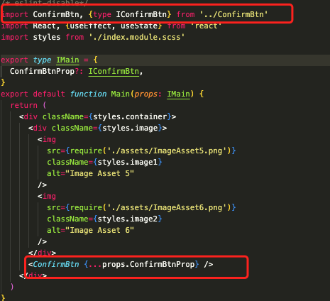

# [进阶] module 用法

:::tip
[视频演示](http://learn.baidu.com/pages/index.html#/video/?courseId=50590&elementId=c4fa65bd-f0c6-4e92-b62f-c50950023c16&groupId=null&curPlayIndex=3)
:::

module的用法与subComp一致，唯一的不同是，携带module标签的图层会将自身节点的代码抽取为子组件并放到单独的目录。

subComp在简单的场景中带来了便利，但组件层级越来越多，这时候清晰的代码目录层级更容易维护，来看看如下例子

设计稿：[https://www.figma.com/design/eQ6iQwUJPCVtZFwSPxdHBv/var-tag-Guide?node-id=460-8&t=s3LEruNvD8zoVKK9-4](https://www.figma.com/design/eQ6iQwUJPCVtZFwSPxdHBv/var-tag-Guide?node-id=460-8&t=s3LEruNvD8zoVKK9-4)

## 使用

继续[subComp 用法](https://ku.baidu-int.com/knowledge/HFVrC7hq1Q/M-wK0zh99p/mTQY0VEf8w/TmYS4uwXcoXKq0)的例子，我们将该例子中的`subComp` tag改为 `module`tag

2. 将例子中的Main也达成module tag， 这时候Main下的ConfirmBtn已经处于第二层组件

## 生成代码

代码将子组件抽取到单独的目录

可以看到 这里的结构更加清晰

这里是Main引用ConfirmBtn

可以看到module tag在抽取子组件方面拥有更清晰的目录结构，这往往在复杂场景中方便我们的维护
