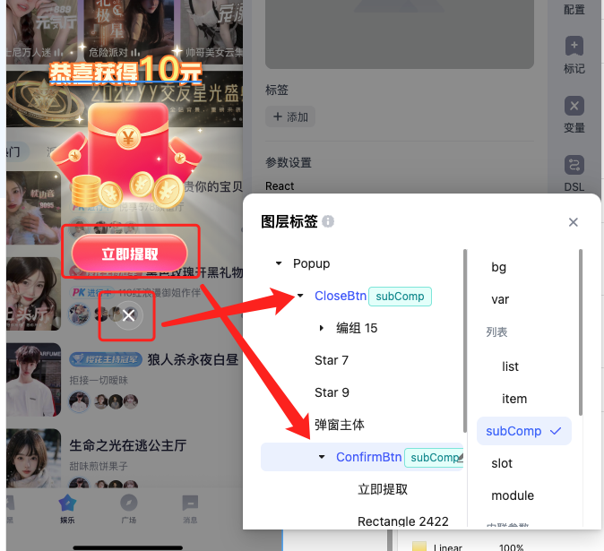
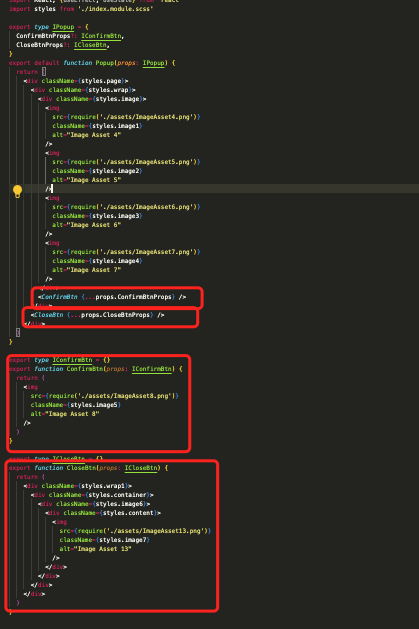
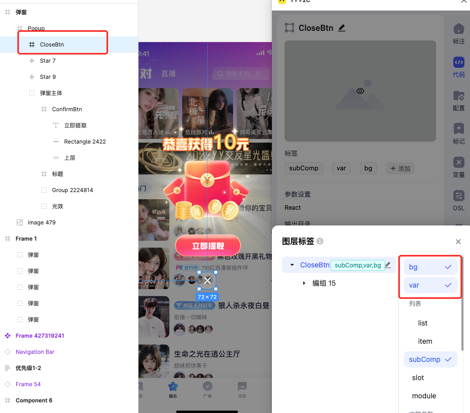
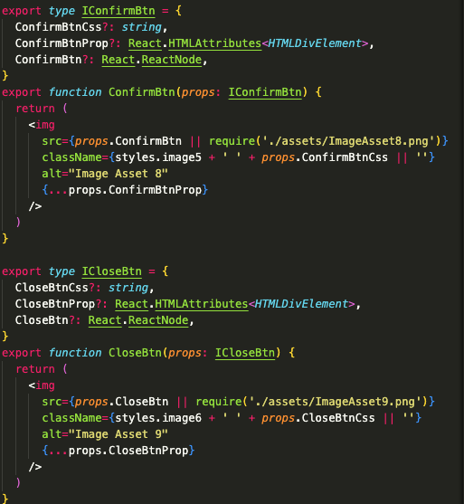
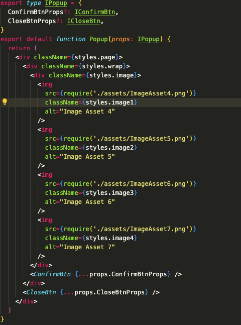

# [进阶] subComp 用法

<!-- :::tip
[视频演示](http://learn.baidu.com/pages/index.html#/video/?courseId=50590&elementId=c4fa65bd-f0c6-4e92-b62f-c50950023c16&groupId=null&curPlayIndex=3)
::: -->

携带subComp标签的图层节点会抽取为子组件代码，起功能类似module，区别是subComp不会为你创建子目录，会直接在原代码文件下创建组件。

设计稿：[https://www.figma.com/design/eQ6iQwUJPCVtZFwSPxdHBv/var-tag-Guide?node-id=460-136&t=s3LEruNvD8zoVKK9-4](https://www.figma.com/design/eQ6iQwUJPCVtZFwSPxdHBv/var-tag-Guide?node-id=460-136&t=s3LEruNvD8zoVKK9-4)

## 基本使用

### 设计稿打上 SubComp Tag

1. 领取按钮图层名改为英文变量，打上subComp tag
2. 关闭按钮同理

### 生成代码

可以看到生成代码被划分为两个组件

### 进阶使用 - 增加组件变量

1. 关闭按钮打上bg tag，让它转为标签，同时也打上var Tag，让关闭按钮组件添加变量入参（如下图）
2. 领取按钮同理

### 再次生成代码

1. 领取按钮和关闭按钮均带上了变量入参

1. 根组件引用了这两个子组件

