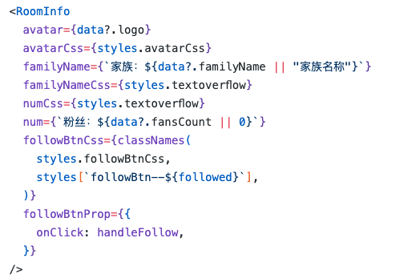

# [进阶] var 用法

## 简介[​](http://localhost:3000/docs/showcase/var#%E7%AE%80%E4%BB%8B)

带有`var`标签的节点，会在生成阶段为节点创建React组件的`Properties`，使一个图层（JSX片段）拥有二次开发的能力。

## 示例

以下是示例的figma文件，

codesandbox地址: [https://codesandbox.io/p/sandbox/39zyz4?file=%2Fsrc%2Ff2c%2Fviews%2FRoomInfo%2Findex.tsx%3A1%2C1](https://codesandbox.io/p/sandbox/39zyz4?file=%2Fsrc%2Ff2c%2Fviews%2FRoomInfo%2Findex.tsx%3A1%2C1)

Figma地址：[https://www.figma.com/file/eQ6iQwUJPCVtZFwSPxdHBv/var-tag-Guide?type=design&node-id=4-2&mode=dev](https://www.figma.com/file/eQ6iQwUJPCVtZFwSPxdHBv/var-tag-Guide?type=design&node-id=4-2&mode=dev)

线上效果：[https://hd-activity-test.yy.com/pcyomi_widget/pc/html/inner.html](https://hd-activity-test.yy.com/pcyomi_widget/pc/html/inner.html)

<iframe data-type="embed" data-embed-type="figma" data-embed-source="https://www.figma.com/file/eQ6iQwUJPCVtZFwSPxdHBv/var-tag-Guide?type=design&amp;t=lQ4fDHsxxv2fPj9U-6" data-embed-source-preview="" data-indent="0" src="https://www.figma.com/embed?embed_host=astra&amp;url=https://www.figma.com/file/eQ6iQwUJPCVtZFwSPxdHBv/var-tag-Guide?type=design&amp;t=lQ4fDHsxxv2fPj9U-6" loading="lazy" allowfullscreen="" sandbox="allow-downloads allow-scripts allow-popups allow-forms allow-same-origin allow-presentation allow-top-navigation-by-user-activation" data-embed-chart-data=""></iframe>

### 1. 将所有需要变量插槽的图层添加var标签

1. 按如图添加图层标签

以下我们直接看下生成的代码

### 2. 生成代码

1. 代码全览图

2. 可以看到，将avatar节点添加`var`标签后，组件为该节点创建了三个入参：`avatarProp`, `avatarCss`, `avatar`,其作用如下表:

| Prop       | 作用                                                   |
| ------------ | -------------------------------------------------------- |
| avatarProp | 为节点dom创建透传属性，扩展HtmlAttribute，如绑定事件等 |
| avatarCss  | 为节点创建className，扩展Style                         |
| avatar     | 为节点创建childNode插槽，扩展内容                      |

1. 通过一系列的变量抽取，我们会这样使用F2C生成的代码

完整代码请参考：

codesandbox地址: [https://codesandbox.io/p/sandbox/39zyz4?file=%2Fsrc%2FRoomInfoArea%2Findex.tsx%3A1%2C1](https://codesandbox.io/p/sandbox/39zyz4?file=%2Fsrc%2FRoomInfoArea%2Findex.tsx%3A1%2C1)

## 总结

我们在生成前就可以站在开发的角度尽可能为组件预留足够的`var标签`。

`var标签`将静态内容与动态数据通过`组件接口层`分离，我们通过组件传参进行内容透传和事件绑定。

这样即使图层重新生成代码，由于组件的接口不变，我们可以轻松地做到UI的无感更新。
