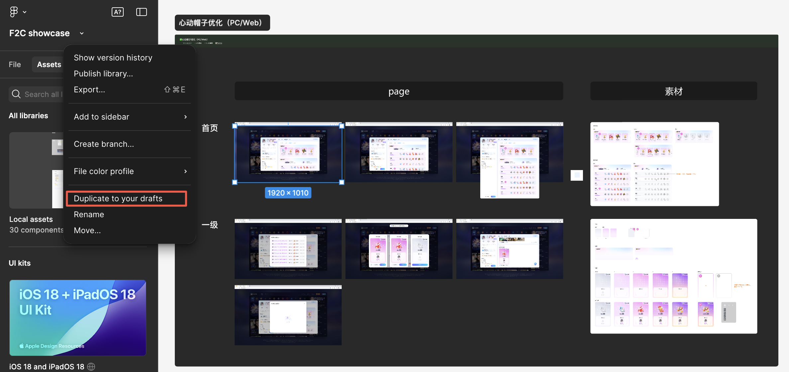
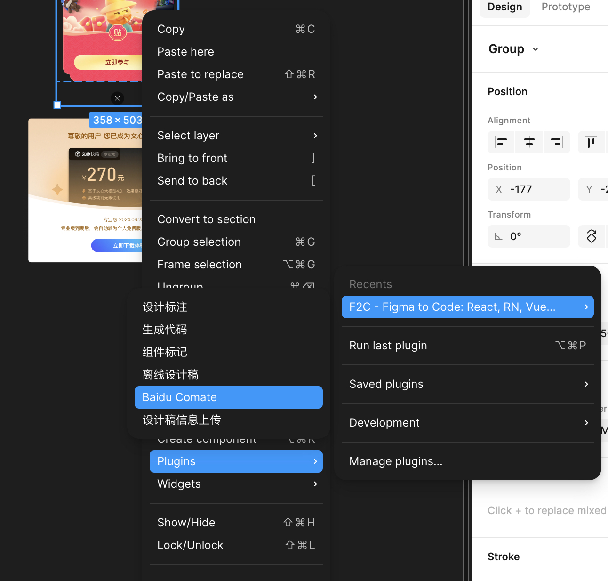
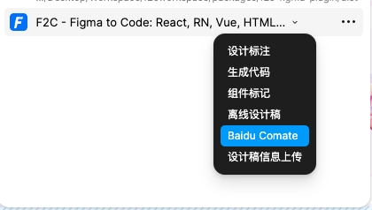
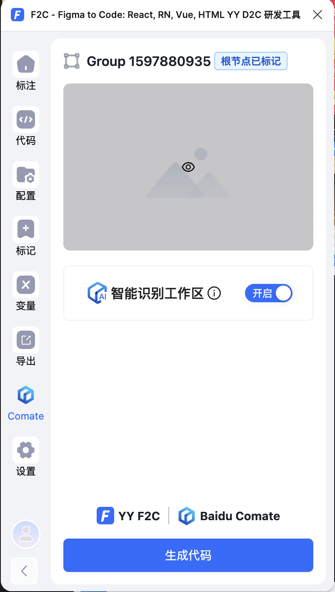
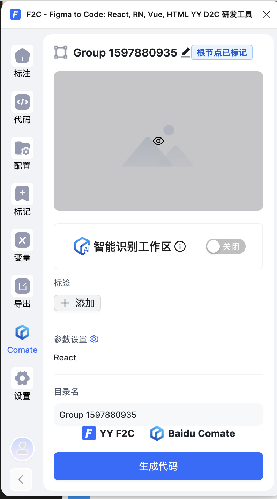
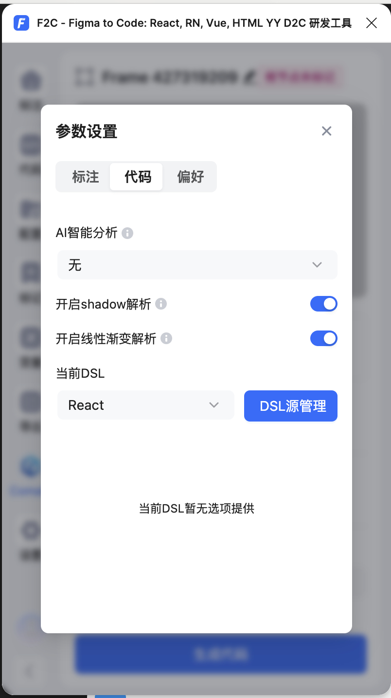
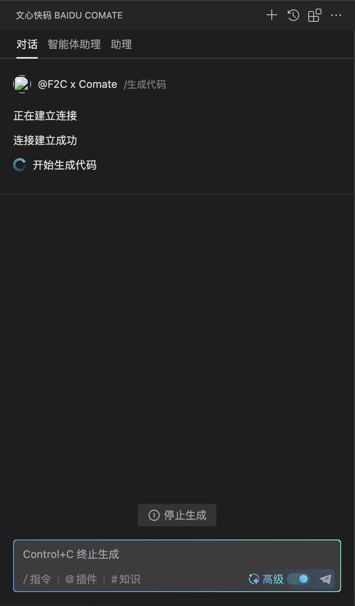

# 基本使用
:::tip
**百度 AI 助力，获得更先进的 D2C 体验**
:::
## 安装
扫码或前往 [VSCode插件市场](https://marketplace.visualstudio.com/items?itemName=BaiduComate.comate) 安装

## 使用步骤

1. VSCode 中打开Comate
2. 打开figma客户端或浏览器，开始试用design 2 code 能力。体验用figma设计图： [f2c测试](https://www.figma.com/design/eQ6iQwUJPCVtZFwSPxdHBv/F2C-showcase?node-id=774-2647&node-type=canvas&t=8afcg88pi8XlgdbG-0)

无设计图编辑权限可能会不显示插件功能。如果无编辑权限，可以复制当前设计图作为自己的草稿再进行测试。

如无权限，点击 duplicate to your drafts，在草稿中操作。

在figma f2c插件中选中新入口 Baidu Comate

选择目标图层，右键选择Pluins -> F2C -> Baidu Comate。

打开f2c插件后，可以根据直接使用智能转换功能，或者按照您的自定义需求设置参数。

智能识别工作区上线，一键适配项目代码风格。

弹框内选择打开vscode，并在vscode中打开uri。

f2c 生成代码。

