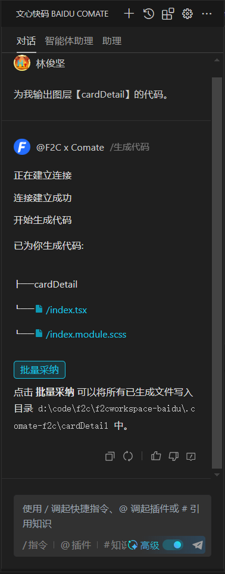
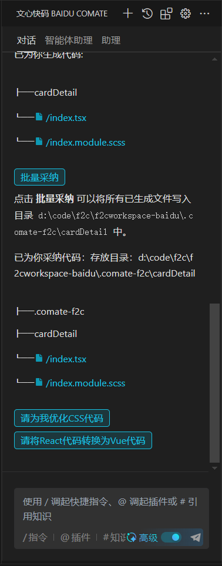

# 基本使用
:::tip
**百度 AI 助力，获得更先进的 D2C 体验**
:::
## 安装
扫码或前往 [VSCode插件市场](https://marketplace.visualstudio.com/items?itemName=BaiduComate.comate) 安装
 

## 使用步骤

1. 打开一个有编辑权限的Fimga设计稿。（[示例设计稿](https://www.figma.com/design/eQ6iQwUJPCVtZFwSPxdHBv/F2C-showcase?node-id=774-2647&node-type=canvas&t=JgbkfAEkMfTmkFTm-0)）

（打开 [示例设计稿](https://www.figma.com/design/eQ6iQwUJPCVtZFwSPxdHBv/F2C-showcase?node-id=774-2647&node-type=canvas&t=JgbkfAEkMfTmkFTm-0)后，点击左边设计稿名字旁边的下拉箭头，在下来菜单里选择 **duplicate to your drafts** ，即可拷贝自己草稿箱）

1. 在设计稿里打开F2C插件，切换到“代码”页面，在“文件导出模式”下拉框选择“百度comate”。

1. 在设计稿中选择一个设计节点，点击插件中的“生成代码”按钮。

（F2C会调起VS Code 的comate, 如有弹窗提示，选择“允许打开”。勾选“始终允许”，可避免每次弹窗确认）

1. F2C 会和comate建立连接，推送代码，直到代码推送完成。点击“批量采纳”，即可在项目中使用代码。

