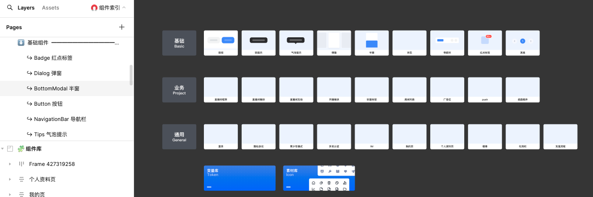
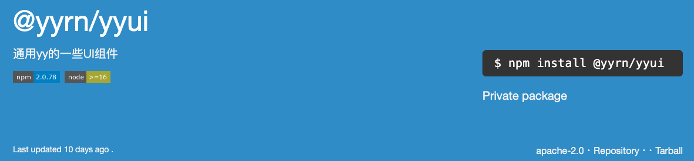
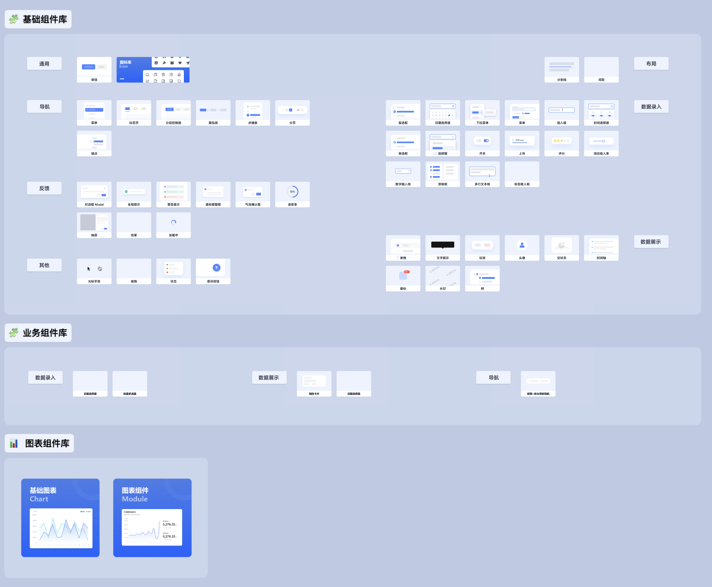
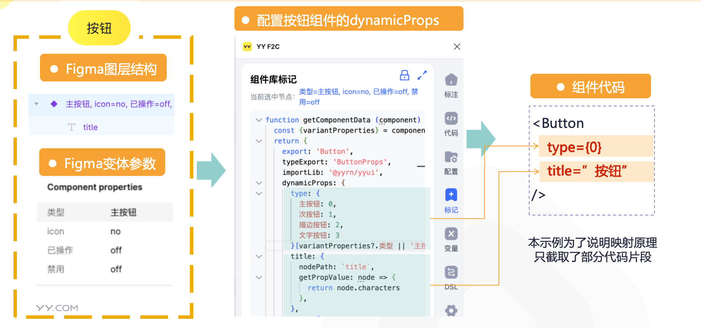
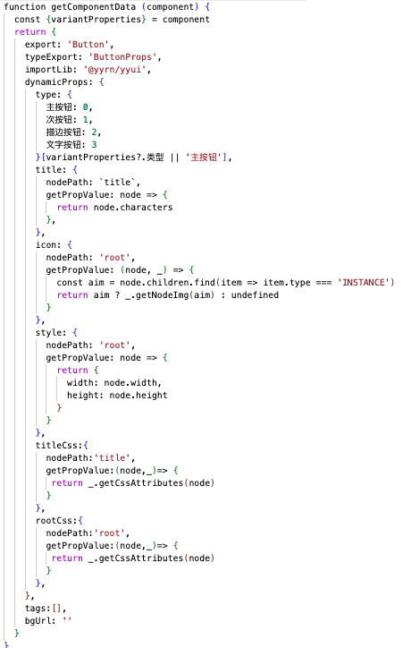
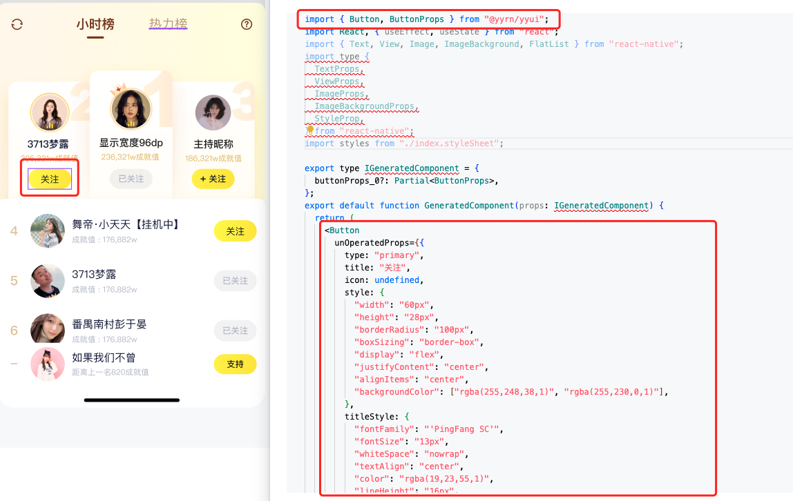

# 介绍

## 简介

`组件标记`是创建`Figma组件库`与`代码组件库`之间的映射关系的一种解决方案。

## 背景

YDC 设计团队维护一套 Figma的手Y基础组件，其对应ReactNative端一侧的代码组件库实现，通过组件标记手段可以将其关联起来。

中后台组件库

## 收益

1. 设计侧通过Figma组件开发，实现设计端的统一。
2. 通过`组件标记`能直接生成组件代码，能够：
   
   1. 降低团队组件使用的接入成本，实现0文档接入。
   2. 降低还原设计稿 => 组件代码过程中的出错几率。

## 流程

1. 设计师提供组件集 
2. 开发标记组件 
3. 设计师迭代组件(开发更新标记)
4. 设计师开发具体需求的时候拖拽带有标记的组件使用
    
## 原理

以 按钮组件（[设计稿](https://www.figma.com/design/cNJ4lpXYaDxqU8ONk2pWck/%E7%BB%84%E4%BB%B6%E5%BA%93-C%E7%AB%AF-%E7%A7%BB%E5%8A%A8%E7%AB%AF-(Copy)?node-id=192-10756&t=zk317WUGDV8XLCVZ-4)）为例，其映射原理如下，具体的标记API可以查看：[【文档】Figma组件配置API](https://ku.baidu-int.com/knowledge/HFVrC7hq1Q/M-wK0zh99p/mTQY0VEf8w/BqRvYe-4gvtg7q)

### 完整示例

* 按钮组件的完整标记

* 按钮组件映射为YYRN组件库代码

## 资料

手Y - Figma组件库：[https://www.figma.com/file/k3GFjuD7URDyW0m60BY6Fr?node-id=3-3&t=PG0dT9l2XQMiSsbM-0&type=design&mode=design&fuid=999578870654951439&editor_type=design](https://www.figma.com/file/k3GFjuD7URDyW0m60BY6Fr?node-id=3-3&t=PG0dT9l2XQMiSsbM-0&type=design&mode=design&fuid=999578870654951439&editor_type=design)

手Y - RN组件库: [https://npm.yy.com/package/@yyrn/yyui](https://npm.yy.com/package/@yyrn/yyui)
