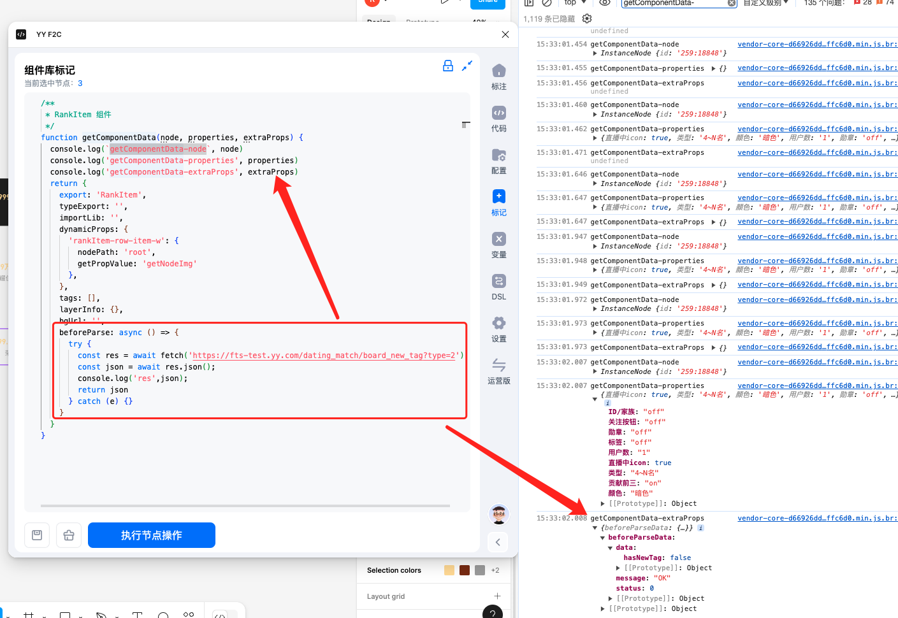

# 组件标记 API

:::tip
下图中的示例，您可以点击[设计稿](https://www.figma.com/design/eQ6iQwUJPCVtZFwSPxdHBv/F2C-showcase?node-id=753-3092&t=zlg6w1wrf4gfZ2VK-4)，并拷贝到自己的 Drafts 中体验
:::


## getComponentData(node, props, extraProps)
函数参数 **ParamsType**

| 参数         | 说明                                 | 类型                              | 备注 |
| -------------- | -------------------------------------- | ----------------------------------- | ------ |
| node       | Figma原始node                     |              https://www.figma.com/plugin-docs/api/nodes/               |      |
| props   | Figma组件的key-value                 | object                            |      |
| extraProps    | 标记体系存放扩展字段的参数，例如beforeParse的返回值                        | object                            |      |


函数返回值 **ReturnType<typeof getComponentData>**

| 返回值对象key         | 说明                                 | 类型                              | 备注 |
| -------------- | -------------------------------------- | ----------------------------------- | ------ |
| export       | 组件的导出模块名                     | string                            |      |
| typeExport   | 组件类型的导出模块名                 | string                            |      |
| importLib    | 组件npm库名称                        | string                            |      |
| constProps   | 组件属性是否转为json，再通过解构传入 | boolean                           |      |
| dynamicProps | 组件的参数映射表                     | { [propKey: string]: IPropValue } |      |
| beforeParse | 异步函数，在组件解析前执行，并将结果回传到getComponentData的 extraProps中，一般用于前置数据初始化等行为                   | (node) =>  any |      |
| afterParse | 同步函数，在组件解析后执行，一般用于包装上传到后端的JSON的数据结构                   | ({code, props, info}) =>  any |      |

## beforeParse
用法如图


## afterParse
用法如图


## dynamicProps

> {[propKey:string]:IDynamicPropsValue}

| 参数                    | 说明                                                                                                                                                                           | 类型                                                                                                                                                                                                                                | 示例                                                                                                                                                   |
| ------------------------- | -------------------------------------------------------------------------------------------------------------------------------------------------------------------------------- | ------------------------------------------------------------------------------------------------------------------------------------------------------------------------------------------------------------------------------------- | -------------------------------------------------------------------------------------------------------------------------------------------------------- |
| propKey                 | 组件参数名称,可以使用'a.b'这种格式                                                                                                                                             | string                                                                                                                                                                                                                              | style ,或[链式写法](#-key的链式写法) 'style.background'                                                                                                                             |
| **IDynamicPropsValue** | 组件参数的映射配置                                                                                                                                                             | **IPropValueObject**                                                                                                                                                                                                               | 两种情况如下                                                                                                                                           |
| nodePath                | 节点路径，具体见                                                                                                                                                        | string 或 string[]                                                                                                                                                                                                                   | 如‘Button>content’,多个变体的层级不一样，可以传入不同层级下的nodePath数组兼容,见[示例](#nodepath的使用说明)                                                                       
| getPropValue            | getPropValue的值是string，调用[*内置方法*](#getpropvalue节点解析函数)得到值 | string                                                                                                                                                                                                                              | [示例](#写法2直接填赋值为方法名可减少代码)                                                                |
| getPropValue            | getPropValue是function，通过node上的figma原生属性拿到值                                                                                                                        | (node, _) => void                    ；  [参数node](https://www.figma.com/plugin-docs/api/nodes/) ；[参数_](#getpropvalue节点解析函数) | [示例](#写法1function写法)


### `nodePath`的使用说明

#### 全路径写法
全路径是最基础的写法，你可以通过锁定根组件节点图层，然后选中子图层在面板中获取节点的全路径。

例子：`Group 8073>Vector 371`


完整示例：https://www.figma.com/design/eQ6iQwUJPCVtZFwSPxdHBv/F2C-showcase?node-id=691-2863&t=94Xx4JbxtDjF78Ff-4


#### 正则写法模糊匹配路径
正则写法可以减少深层节点路径带来的nodePath的复杂度增加。其写法灵活性更高。

例子：`/.*?\>前3名\>.*?bg/` , `/榜单列表标题/`


完整示例：https://www.figma.com/design/eQ6iQwUJPCVtZFwSPxdHBv/F2C-showcase?node-id=649-1842&t=94Xx4JbxtDjF78Ff-4


#### 以$前缀命名图层
使用$前缀命名图层，相比全路径写法标记更快速，但是要注意同一个组件实例下不能有同名的nodePath，因为相比于全路径写法，$前缀写法需要确保唯一性才能准确定位到图层。

例子：`$头图`


完整示例：https://www.figma.com/design/eQ6iQwUJPCVtZFwSPxdHBv/F2C-showcase?node-id=636-1350&t=94Xx4JbxtDjF78Ff-4

#### nodePath的数组写法
在复杂中，组件不同变体导致了节点位置可能在不同的图层路径下，这时候nodePath可以使用数组指定多种路径可能性来进行匹配


完整示例： https://www.figma.com/design/eQ6iQwUJPCVtZFwSPxdHBv/F2C-showcase?node-id=706-2570&t=94Xx4JbxtDjF78Ff-4


## 使用场景和示例

### **场景1** : Figma原生属性映射、

直接在组件节点上获取变体参数，映射到对应的props上

如以下代码会解析为`<Button type='primary' danger={true} disabled={false} />`

```js
function getComponentData(component) {
  const {variantProperties} = component
  return {
    dynamicProps: {
      type: {
        主要按钮: 'primary',
        次要按钮: 'default',
        线形按钮: 'default',
        虚线按钮: 'dashed',
        文本按钮: 'text',
        链接按钮: 'link',
      }[variantProperties.样式],
      danger: variantProperties.类型 === '危险',
      disabled: variantProperties.状态 === '禁用',
    },
  }
}
```

### **场景2** ：dynamicProps获取节点属性

定义object的nodePath和getPropValue结合使用，可以获取图层节点的信息转化为组件的props，

如以下代码会解析为`<Button textStyle={{fontSize: 14}} />`

```js
function getComponentData() {
  return {
    dynamicProps: {
      textStyle: {
        // 图层位置路径
        nodePath: 'Button>content',
        // 获取图层字体大小
        getPropValue: node => {
          return {
            fontSize: node.fontSize,
          }
        },
      },
    },
  }
}
```

### **场景3** ：Key的链式写法

接场景二，以下代码同样会解析为`<Button textStyle={{fontSize: 14}} />`

```js
function getComponentData() {
  return {
    dynamicProps: {
      'textStyle.fontSize': {
        nodePath: 'Button>content',
        getPropValue: node => {
          return node.fontSize
        },
      },
    },
  }
}
```

### **场景4** ：getPropValue 工具函数调用

以下配置解析为`<Button textStyle={{color: '#FFF'}} />`

#### 写法1：function写法

```js
function getComponentData() {
  return {
    dynamicProps: {
      'textStyle.color': {
        nodePath: 'Button>content',
        getPropValue: (node, _) => {
          return _.getTextColor(node)
        },
      },
    },
  }
}
```

#### 写法2：直接填赋值为方法名，可减少代码量
```js
function getComponentData() {
  return {
    dynamicProps: {
      'textStyle.color': {
        nodePath: 'Button>content',
        getPropValue: 'getTextColor'
      },
    },
  }
}
```
#### 写法3：字符串模板写法 ，(注意使用引号）

解析为`<Button textStyle={{fontSize: '14px'}} />`

```js
function getComponentData() {
  return {
    dynamicProps: {
      'textStyle.fontSize': {
        nodePath: 'Button>content',
        // 使用单引号或双引号
        getPropValue: '${getFontSize}px'
        // 也可以用如下写法
        // getPropValue: (node, _) => `${_.getFontSize(node)}`
      },
    },
  }
}
```

### **场景4** ：使用合并配置到单个Key

#### 写法1：约定数组每一项的`getPropValue`返回值返回 `object`，生成后将合并

以下配置解析为`<Button style={{ fontSize: 14, backgroundColor: '#ccc' }} />`

```js
function getComponentData() {
  return {
    dynamicProps: {
      'style': [
          {
            nodePath: 'Button>content',
            getPropValue:(node) => {
              return{
                fontSize: node.fontSize
              }
            }
          },
          {
            nodePath: 'Button',
            getPropValue:(node，_) => {
              return{
                backgroundColor: _.getBackgroundColor(node)
              }
            }
          },
      ]
    },
  }
}
```

#### 写法2：约定数组每一项的`getPropValue`返回值返回 `非object`，则会以数组形式合并

以下配置解析为`<Button style={[14, '#ccc']} />`
```js
function getComponentData() {
  return {
    dynamicProps: {
      'style': [
          {
            nodePath: 'Button>content',
            getPropValue:(node) => node.fontSize
          },
          {
            nodePath: 'Button',
            getPropValue:(node，_) => {
              return _.getBackgroundColor(node)
            }
          },
      ]
    },
  }
}
```
## getPropValue节点解析函数

| 函数名                          | 类型                       | 作用                                             | 返回值示例                                                                                                         | 备注                                                                                                 |
| --------------------------------- | ---------------------------- | -------------------------------------------------- | -------------------------------------------------------------------------------------------------------------------- | ------------------------------------------------------------------------------------------------------ |
| **getStyles**                  | () => {}                         | 获取节点css属性                                  | {width: "123px", height: "123px"}                                                                                  | [getStyles详细用法](https://ku.baidu-int.com/knowledge/HFVrC7hq1Q/M-wK0zh99p/mTQY0VEf8w/9f1b425018a041) |
| getGradientColors               | string[]                   | 获取节点的渐变色数组                             | [''#fff', '#000']                                                                                                  |                                                                                                      |
| getNodeImg                      | string                     | 获取节点的图片资源地址                           | require('./assets/ImageAsset2.png'),预览时返回图片的cdn地址                                                        |                                                                                                      |
| getNodeText                     | string                     | 获取节点文案内容                                 | ‘昵称’                                                                                                           |                                                                                                      |
| setNodeMarkInfo                 | (node, key, value) => void | 用于打tag （beta）                               | _.setNodeMarkInfo(node, 'tags', ['innerProps_class']) _.setNodeMarkInfo(node, 'layerInfo', {varName: 'rollupBox'}) |                                                                                                      |
| getComponentInfoByNode          | () => {}                         | 用于嵌套组件的标记信息和组件参数                 | {info: {} // 标记内容props: {} // 组件入参}                                                                        |                                                                                                      |

## 参考

Figma Node 官方文档：[https://www.figma.com/plugin-docs/api/nodes/](https://www.figma.com/plugin-docs/api/nodes/)
