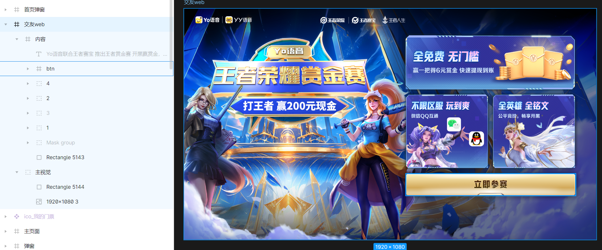
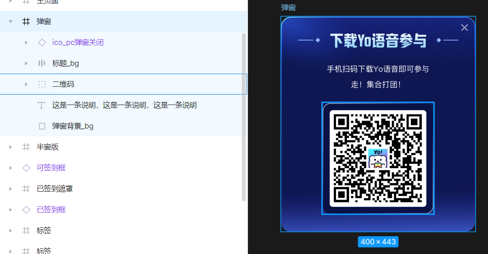

# 王者荣耀赏金赛-宣发页

手写十几行代码，一分钟不用，就可以完成需求任务的开发。
线上页面地址：https://hd-activity.yy.com/yo_2024_kingofglory/pc/html/promotional.html

## PC宣发页

### 设计图


“立即参赛”按钮有交互逻辑，打上var标签，方面后面将二次开发代码与生成代码分开。选择整个页面的节点，点击生成。
### 生成的代码
```typescript
/* eslint-disable*/
import React, {useEffect, useState} from 'react'
import styles from './index.module.scss'

export type IPromotionalPageWeb = {
  btnCss?: string,
  btnProp?: React.HTMLAttributes<HTMLDivElement>,
  btnContent?: React.ReactNode,
}
export default function PromotionalPageWeb(props: IPromotionalPageWeb) {
  return (
    <div className={styles.friendWeb}>
      <div className={styles.mainVision}>
        <div className={styles.content}>
          <div className={styles.container}></div>
          <div className={styles.num1}>
            <div className={styles.bg}>
              
            </div>
            
            
          </div>
          <div className={styles.num2}>
            <div className={styles.image5}>
              
              <div className={styles.content2}>
                
                
              </div>
              
            </div>
          </div>
          <div className={styles.num4}>
            <div className={styles.image10}>
              
              
            </div>
          </div>
          
        </div>
      </div>
    </div>
  )
}

```
```css
.friendWeb {
  width: 1920px;
  // height: 1080px;
  height: 100vh;
  overflow: hidden;
  background-color: rgba(255, 255, 255, 1);
  // display: flex;
  // justify-content: center;
  // align-items: center;
}

.mainVision {
  display: flex;
  justify-content: flex-end;
  align-items: flex-start;
  width: 1920px;
  height: 1080px;
  @include bg('./assets/ImageAsset1.png');
  background-size: cover;
}

.content {
  width: 858px;
  height: 856px;
  margin-top: 53px;
  margin-right: 63px;
  position: relative;
}

.container {
  width: 845px;
  border-radius: 22.23px;
  min-height: 806px;
  position: absolute;
  top: 46px;
  left: 4px;
}

.num1 {
  position: absolute;
  top: 12px;
  left: 14px;
  width: 827.5px;
  height: 435.38px;
}

.bg {
  position: absolute;
  top: 27.91px;
  left: 0px;
  display: flex;
  justify-content: flex-start;
  align-items: flex-start;
  width: 827.5px;
  height: 304.59px;
  background-image: url("./assets/ImageAsset2.png");
  background-size: 100% 100%;
  background-repeat: no-repeat;
}

.freeNoThreshold {
  width: 332.91px;
  height: 76.77px;
  margin-top: 91.94px;
  margin-left: 41.75px;
}

.image3 {
  width: 435.38px;
  height: 435.38px;
  position: absolute;
  top: 0px;
  left: 389px;
}

.win6BountyQuickWithdrawal {
  width: 385.26px;
  height: 33.89px;
  position: absolute;
  top: 205.94px;
  left: 49.74px;
}

.num2 {
  position: absolute;
  top: 328px;
  left: 15.97px;
  display: flex;
  justify-content: center;
  align-items: center;
  width: 420.49px;
  height: 383.52px;
}

.image5 {
  display: flex;
  flex-direction: column;
  justify-content: flex-start;
  align-items: flex-start;
  width: 420.49px;
  height: 383.52px;
  background-image: url("./assets/ImageAsset6.png");
  background-size: 100% 100%;
  background-repeat: no-repeat;
}

.unlimitedPlayEnjoyable {
  width: 289.59px;
  height: 55.82px;
  margin-top: 44.26px;
  margin-left: 35.31px;
}

.content2 {
  width: 234.29px;
  height: 85.2px;
  margin-top: 7.32px;
  margin-left: 41.12px;
  display: flex;
  justify-content: space-between;
  align-items: flex-start;
}

.wechatQQInteroperability {
  width: 130.55px;
  height: 29.62px;
}

.maskGroup {
  width: 65.17px;
  height: 65.17px;
  margin-top: 20.03px;
}

.image9 {
  width: 70.28px;
  height: 70.28px;
  margin-left: 312.46px;
}

.num4 {
  position: absolute;
  top: 328px;
  left: 421.14px;
  display: flex;
  justify-content: center;
  align-items: center;
  width: 420.49px;
  height: 383.52px;
}

.image10 {
  display: flex;
  flex-direction: column;
  justify-content: flex-start;
  align-items: flex-start;
  width: 420.49px;
  height: 383.52px;
  background-image: url("./assets/ImageAsset11.png");
  background-size: 100% 100%;
  background-repeat: no-repeat;
}

.allHeroAllRune {
  width: 252.43px;
  height: 55.78px;
  margin-top: 44.26px;
  margin-left: 35.27px;
}

.fairPlayEnjoyRanking {
  width: 199px;
  height: 28.34px;
  margin-top: 7.19px;
  margin-left: 41.12px;
}

.btn {
  width: 854px;
  height: 166px;
  position: absolute;
  top: 686.5px;
  left: 2.5px;
}
```

## 二维码弹窗
### 设计图


关闭按钮需要调用外部接口，打上var标签。选择整个页面，点击生成
### 生成的代码

(篇幅原因，不再贴css代码)
```typescript
export type IPromotionalPagePopup = {
  btnProp?: React.HTMLAttributes<HTMLImageElement>,
}
export default function PromotionalPagePopup(props: IPromotionalPagePopup) {
  return (
    <div className={styles.popup}>
      <div className={styles.popupBg}>
        <div className={styles.wrap}>
          <div className={styles.titleBg}>
            <div className={styles.content}>
              <div className={styles.main}></div>
              
            </div>
            
            
          </div>
          <div className={styles.thisIsAStatementThi}>
            <div className={styles.thisIsAStatementThi__linebreak}>
              手机扫码下载Yo语音即可参与
            </div>
            <div>走！集合打团！</div>
          </div>
          
        </div>
        
      </div>
    </div>
  )
}
```

## 代码组合

    将PC宣发页生成的代码与二维码弹窗生成的代码进行组合，补上交互代码，整个过程只需手写十几行代码，不用一分钟的时间就完成需求开发。
```typescript
import App, {IPromotionalPageWeb} from 'src/f2c/views/PromotionalPageWeb'
import {createRoot} from 'react-dom/client'
import {showAlertModal} from 'src/shared/utils/commonFn'
import PromotionalPagePopup from 'src/f2c/views/PromotionalPagePopup'

const prop: IPromotionalPageWeb = {
  btnProp: {
    onClick: () => {
      const modal = showAlertModal({
        context: <PromotionalPagePopup btnProp={{onClick: () => modal.closeModal()}} />,
        className: 'autoSizeDialog',
      })
    },
  },
}

const container = document.getElementById('emp-root') as HTMLElement
const root = createRoot(container)
root.render(<App {...prop} />)

```


:::warning
    代码生成启动内部GPT的变量名优化，可读性特别友好。外面用户无法启用，但不太影响代码阅读。
:::
